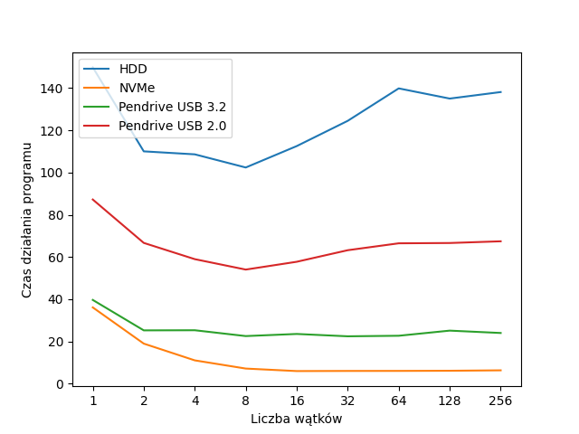
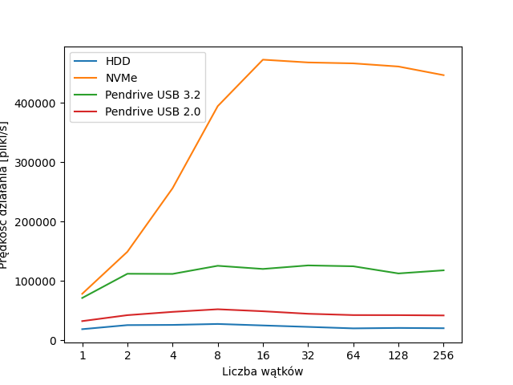

# Wstęp
Celem niniejszego sprawozdania jest analiza wpływu wielowątkowości na wydajność aplikacji wykonującej głównie operacje I/O.

# Testowana aplikacja
Na potrzeby testu przygotowaliśmy aplikację, która w sposób rekurencyjny eksploruje drzewo katalogów i oblicza całkowity rozmiar wszystkich plików. Aplikację tę można skonfigurować tak, by wykorzystywała określoną przez nas liczbę wątków.

# Procedura testowa
W celu analizy wpływu wielowątkowści na wydajność opisanej wyżej aplikacji zmierzyliśmy czas wykonania aplikacji na czterech różnych nośnikach danych i tym samym folderze testowym (2.835.154 plików, 10.5GB rozmiar, maksymalny stopień zagnieżdżenia katalogów: 5, bardzo małe pliki, często <1kB).

Aplikacja ta była uruchamiana na laptopie z zainstalowanym systemem Fedora 41 (wersja jądra 6.13.8) i 8 rdzeniowym procesorem Intel Core i9.

# Wyniki testów
| Wątki | NVMe  | HDD    | Pendrive 2.0 | Pendrive 3.2 |
|-------|-------|--------|--------------|--------------|
| 1     | 36.14 s | 149.83 s | 87.22 s       | 39.68 s       |
| 2     | 19.00 s | 110.02 s| 66.68 s      | 25.27 s       |
| 4     | 11.07 s | 108.61 s| 58.99 s       | 25.33 s       |
| 8     | 7.19 s | 102.38 s| 54.05 s       | 22.57 s       |
| 16    | 6.00 s | 112.52 s| 57.75 s       | 23.57 s       |
| 32    | 6.06 s | 124.47 s| 63.22 s       | 22.46 s       |
| 64    | 6.08 s | 139.83 s| 66.49 s       | 22.72 s       |
| 128   | 6.15 s | 135.01 s| 66.63 s       | 25.15 s       |
| 256   | 6.35 s | 138.10 s| 67.44 s        | 24.03 s       |

\

# Dodatkowa uwaga
Współczesne systemy plików są na tyle mądre, że trzymają ostatnio otrzymywane dane w pamięci RAM tak długo, jak system nie wykazuje zapotrzebowania na tę pamięć - zgodnie z powiedzeniem "Niewykorzystany RAM to zmarnowany RAM". Na skutek tego ponowne uruchomienia aplikacji skutkowały znacznie krótszymi czasami wykonania i skutkowałoby niemiarodajnością wyników testów. Z tego też powodu co każde uruchomienie aplikacji system operacyjny był uruchamiany ponownie.
Brak restartu skutkowałby czasem nawet rzędu 4 sekund dla dysku NVMe.

# Wnioski
Wydajność aplikacji wielowątkowej wykonującej operacje I/O zależy głównie od prędkości nośnika danych – to on stanowi wąskie gardło. Na wolnych dyskach wzrost wydajności jest minimalny, natomiast szybkie nośniki NVMe pozwalają na znaczne przyspieszenie dzięki wielowątkowości. Na szczęście dyski NVMe stają się dziś standardem.

Druga sprawa to fakt, że wydajność zależna jest od zainstalowanego procesora. Na 16-wątkowym procesorze nie jesteśmy w stanie zanotować wzrostu wydajności przy wykorzystaniu więcej niż 8 wątków.